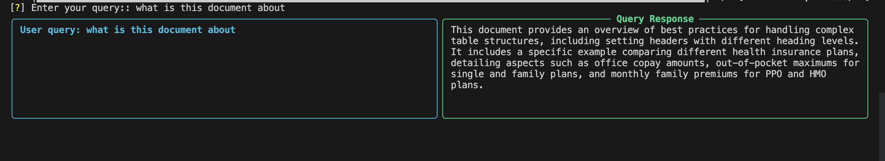

# LlamaParse Script

This repository contains a Python script that utilises LlamaParse for transforming documents for querying using GPT4o. The script is enhanced with `inquirer` for interactive user input and `rich` for formatted terminal output.

## Features

- Load and parse documents from a PDF file.
- Use OpenAI's GPT-4o model for language processing.
- Structured and visually appealing output using `rich`.

## Requirements

```bash
pip install -r requirements.txt
```

## Usage

1. **Set up environment variables**:
   Create a `.env` file in the root directory and add your API keys:

   ```
   LLAMA_CLOUD_API_KEY=your_llama_cloud_api_key
   OPENAI_API_KEY=your_openai_api_key
   ```

2. **Prepare your document**:
   Place your PDF document in the `data` directory.
3. **Run the script**:

   ```bash
   python main.py
   ```

   The script will prompt you to enter your search query and will display the query and response in a formatted layout.

## Example

**Prompt for Query & Formatted output**:
   

